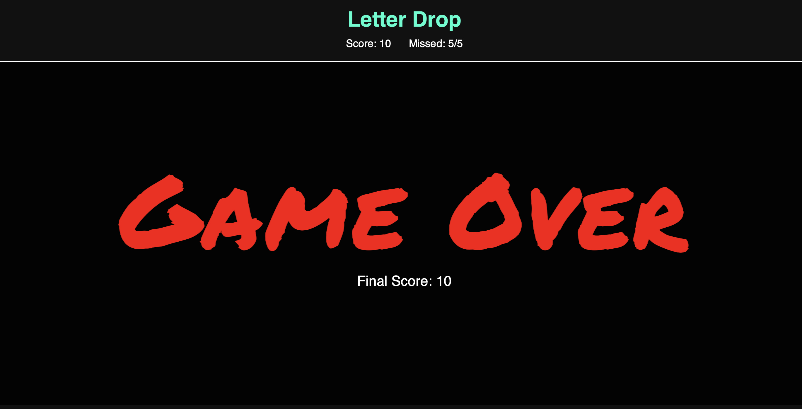
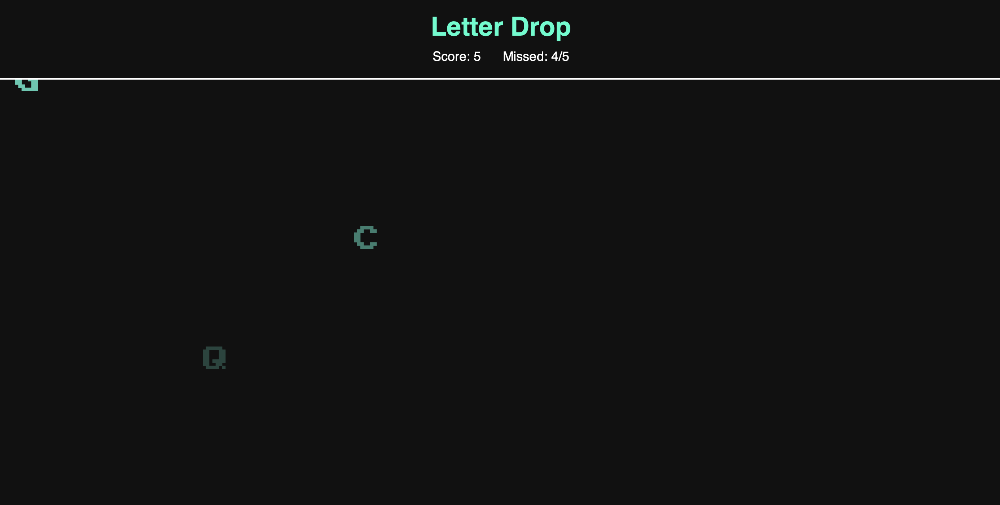

//Guidance
Game name：Letter Drop’.
Screenshot

Game description： Random letters (ABCDE…) will be generated and fall from the top of screen, the player needs to type the correct key on the keyboard.
Win/lose scenario: If the player misses/ doesn’t type the correct keys for 5 times, game ends and final score shows.

Background：Replace boring typing exercise in a more interactive way, similar to 'frunit ninja'.

//Get start
https://graceyu113.github.io/LetterDrop/

//Attributions
Google fonts: 'Press Start 2P' for droping letters. 'Permanent Marker' for Game Over. 
requestAnimationFrame  MDN link: https://developer.mozilla.org/zh-CN/docs/Web/API/Window/requestAnimationFrame
-->letterInterval controls the fall speed of new letters, decreasing over time.
-->animationDuration shortens as speedMultiplier increases, making letters fall faster and raising the difficulty.

//Technology used
HTML
CSS: animation
JS: DOM manipulation, Event lisetner

// level-up content to be added
Add background music for correct & wrong letters

 